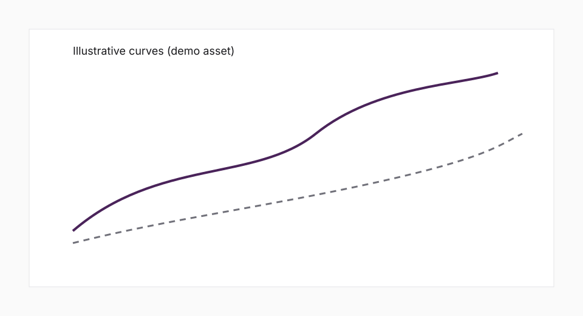

The intersection of geopolitical pressure and economic incentives rarely produces simple stories. When leaders signal urgency around an exit, markets look past rhetoric and toward constraints: financing conditions, alliance credibility, and the secondary effects of sanctions regimes.

## A simple demand sketch

The chart below is stored alongside this article as a relative asset—useful for newsroom workflows that keep figures near the text they support.

### What we are watching next

- Whether coordination costs inside alliances show up first in procurement timelines or in funding spreads.
- How energy supply narratives reprice risk if diplomatic paths narrow.

This article is sample content for the Econography demo site.
