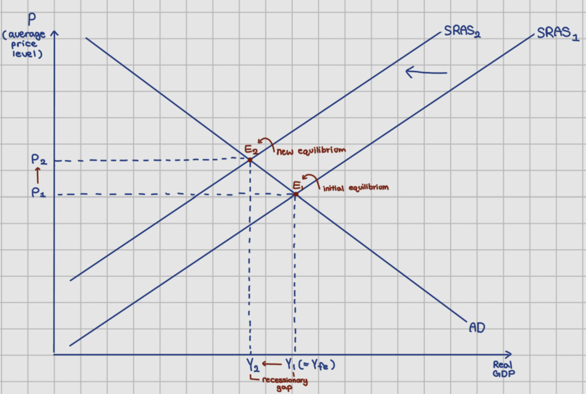

## Overview

- Who: European stock markets (particularly the STOXX 600 index), global investors, and countries involved in the Middle East conflict (including Iran, the U.S., and Israel)
- What: European shares dropped to a four-month low as geopolitical tensions in the Middle East intensified, reflecting growing uncertainty in global financial markets
- How: The conflict led to a rise in oil prices, which increased concerns about inflation. As a result, investors started to sell stocks and move to safer assets

## Definition

- Geopolitical risk: The risk that political or military conflict affects economic stability
- Cost-push inflation: Inflation caused by substantial increases in the cost of goods or services where no substitutes are available; it occurs when production costs rise (e.g., oil prices)
- Inflation: A sustained increase in the general price level
- Investor behaviour (risk aversion): Investors tend to avoid risk during uncertain times; when geopolitical tension rises, investors often sell stocks and move to safer investments

## Cause

### Cost-push inflation and interest rate expectations

1. Oil price increases → cost of production rises
2. SRAS shifts left from SRAS1 to SRAS2
3. Price level increases (inflation rises) from P1 to P2
4. Recessionary gap between Yf and Y2
5. Central bank is expected to raise interest rates
6. Borrowing costs increase → investment decreases
7. Lower investment → firms’ expected profit falls
8. Stock prices fall due to reduced investor confidence

## Consequences

- Decline in European stock markets
- Investor confidence decreases and risk aversion increases
- Increased market volatility and uncertainty
- Expectations for economic growth decline

## Stakeholders

### Consumers

- Face higher prices due to inflation
- Consumption may decrease due to uncertainty
- Reduced real income → reduced purchasing power

### Government

- Pressure to increase interest rates to control inflation
- Must balance inflation control and economic stability

### Producers

- Higher production costs, especially for energy-dependent firms
- Reduced marginal revenue
- Investment and expansion are lowered

## Long run vs Short run impacts

### Short-run

- Sharp fall in stock prices
- Rising inflation
- High financial market volatility

### Long-run

- Economic slowdown or recession may occur
- Shift toward alternative energy sources
- Sustained higher interest rates

## Pros & Cons

### Pros

- Higher profits for energy companies due to rising oil prices
- Buying opportunities for long-term investors as stock prices fall
- Increased awareness and preparation for geopolitical risks

### Cons

- Decline in stock market value and investor confidence
- Rising inflation from higher energy costs
- Risk of economic slowdown due to uncertainty and reduced spending
- Increased market volatility and instability

## Judgement / Evaluation

- The link between cost-push inflation and financial markets is driven primarily by expectations: investors anticipate tighter monetary policy before it fully materialises, which depresses equity valuations even when output effects are still unfolding. Policy credibility and clear communication from central banks are therefore as important as the energy shock itself in stabilising markets.
