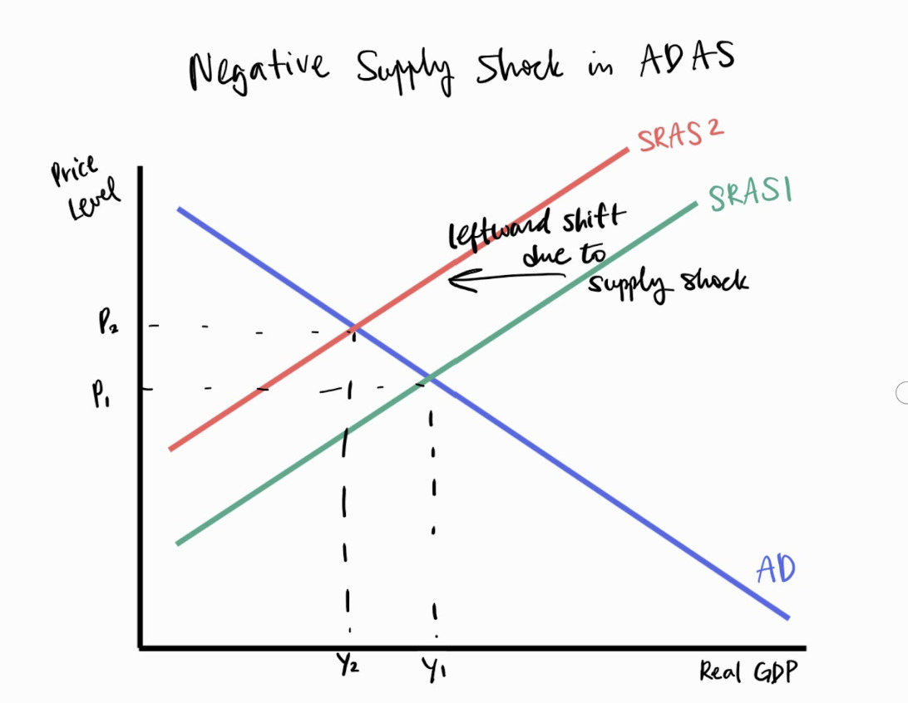

## Overview

- Who: The United States, Israel, and Iran
- What: Due to the conflict, the prices of resources and stocks have fluctuated. It has also led to lower productivity and a decrease in trade volume through the Strait of Hormuz
- Why: Iran's threats to the Strait of Hormuz and attacks on energy facilities have created a physical and psychological bottleneck in global oil and gas distribution

## Definition

- Petrol prices: The cost per unit (litre or gallon) of refined petroleum
- Stagflation: Persistent high inflation combined with high unemployment and stagnant demand in a country’s economy
- Negative supply shock: An unexpected event that reduces the aggregate supply of a product or commodity
- Global interdependence: The mutual reliance between nations for resources, goods, services, and economic stability

## Cause

1. Supply curve shift: Geopolitical instability causes the short-run aggregate supply (SRAS) curve to shift leftward (SRAS1 → SRAS2)
2. Price increase: The equilibrium price level increases (P1 → P2), leading to cost-push inflation
3. Real GDP falls: The quantity of national output produced declines (Y1 → Y2)
4. Production costs rise: High energy prices increase logistics fees and operational costs for all firms
5. Unemployment increases: As output (Y) falls, the demand for labour decreases

## Consequences

- The conflict has resulted in an underproduction of goods relative to the previous equilibrium, causing a contraction in global trade volume and lower industrial productivity

## Stakeholders

### Consumers

- Face higher petrol and electricity prices
- Reduced purchasing power leading to a lower standard of living

### Government

- Increased fiscal burden to provide energy vouchers or subsidies
- Difficulty in managing monetary policy (inflation vs. recession)

### Producers

- Profit margins decline due to higher input costs and production costs
- Supply chain disruptions through the Strait of Hormuz lead to production delays

## Long run vs Short run impacts

### Short-run

- Immediate volatility in stock markets
- Temporary government interventions (e.g., fuel tax cuts) to lower logistic fees

### Long-run

- Potential shift toward energy independence and renewable resources
- Persistent national debt if energy subsidies are maintained for too long

## Pros & Cons

### Pros

- Lower logistic fees may reduce the price of some products
- Higher oil prices may benefit oil-exporting countries
- Incentive for oil-dependent countries to seek substitutes such as renewable energy
- Opportunity for countries to transition to renewable energy instead of oil

### Cons

- Risk of attacks on ships, causing injury to innocent people
- Higher inflation leads to decreased consumer purchasing power
- Reduced economic growth
- In the short run, Asia faces sudden energy shortages and rising inflation due to disruption of the Strait of Hormuz

## Judgement / Evaluation

- The conflict creates a classic stagflationary trap. While short-term fiscal support (subsidies) can alleviate some pain, it does not solve the root cause of the supply shock. The global economy remains highly vulnerable as long as energy security is tied to a single, volatile geographic chokepoint.
