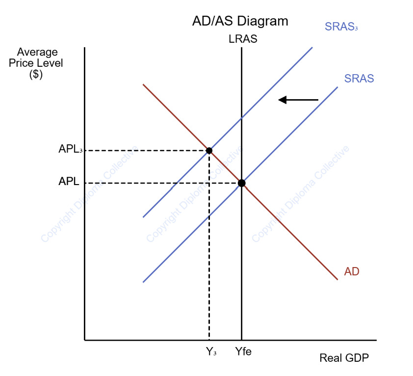

## Overview

- Who: Households and borrowers in the UK, including mortgage holders
- What: Britons face another cost-of-living crisis linked to the Iran war, with higher mortgage costs, energy bills, fuel prices, food prices, and holiday and travel costs
- Mortgage rates:
  - 1,000 mortgage products pulled by lenders
  - The Iran war and Trumpflation push up borrowing costs (e.g. for a £250,000 mortgage, paying about £900 more annually)
  - 1.8 million deals are due to end in 2026; most of these borrowers need to secure a new mortgage at higher borrowing costs
  - Bank of England held rates at 3.75%
  - Average two-year fixed mortgage has risen by around 0.5% to 5.35%
- Energy bills and fuel prices:
  - Petrol: from about 150p to 144.51p per litre (9% change)
  - Diesel: from about 180p to 166.24p per litre (17% change)
  - Price of petrol and diesel increased by about £6.40 and £13 respectively

## Definition

- Trumpflation: Anticipated or actual rises in inflation and consumer prices resulting from the economic policies of President Donald Trump.
- Mortgage: A secured loan used to purchase real estate or borrow against its value.
- Interest rates: The cost of borrowing money or the reward for saving money.
- Stagflation: Persistent high inflation combined with high unemployment and stagnant demand in a country’s economy.
- Cost-push inflation: Inflation caused by the increased price of raw materials or higher wages.

## Cause

### Trumpflation (stagflation)

1. Leftward shift in SRAS: SRAS1 → SRAS2
2. Increase in price from P1 to P2
3. Recessionary gap between Yf and Y2

### Monetary channel

1. Inflation expectations increase
2. Bank of England maintains or increases interest rates
3. Borrowing costs increase, leading to higher mortgages
4. Disposable income declines, providing an incentive for consumers to reduce consumption
5. AD shifts to the left

## Consequences

- The stagflation led to an increase in the price level and falling real output.

## Stakeholders

### Consumers

- Face higher borrowing costs, energy costs, fuel costs, and a higher cost of living
- Decreased purchasing power
- Decreased consumer surplus
- Fall in real income

### Government

- Greater economic and fiscal pressure
- May need to introduce support policies
- Faces a trade-off between controlling inflation and supporting economic growth

### Producers

- Higher production costs
- Reduced profit margins or marginal revenue

## Long run vs Short run impacts

### Short-run

- Fall in consumer real income
- Increased cost of living
- High cost of production leading to a loss

### Long-run

- Government debt may increase due to support measures
- Firm investment in energy efficiency
- Diversified supply chains

## Assumption

- The Bank of England raises interest rates to control inflation

## Pros & Cons

### Pros

- Higher interest rates help reduce inflation
- Encourages saving over borrowing
- Inflation may be reduced by lowering spending

### Cons

- Mortgages and loans will be more expensive for households
- Risk of recession due to falling consumption
- Increased interest rates would discourage borrowers
